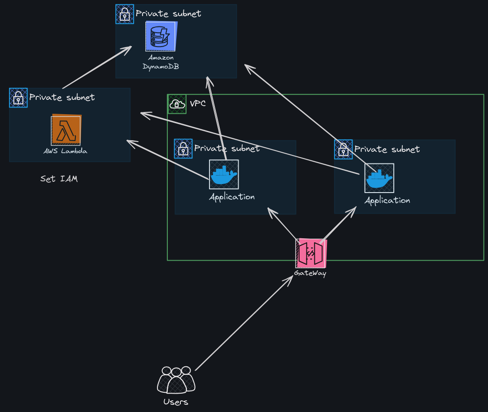
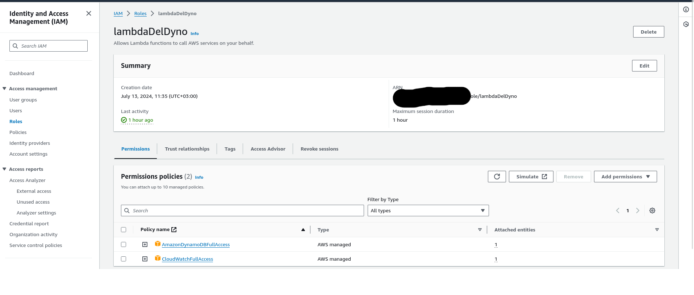
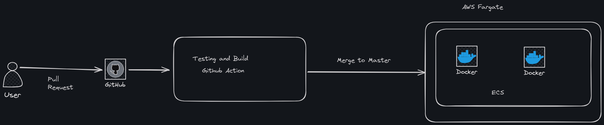

# Dynamodb Lambda Case 
Thank you for reading :))
## Local Development
For local development you have to create an .env file which is given in example.env file you should enter your own 
attributes. Also for testing you should use 8080 port.
For testing, you can use "test.sh" script that is a basic script that puts 100 item in your db. 

### Testing
For testing if your port is 8080 you can use these commands:

Also, I recommend to use `jq` for checking response.
#### Get Item
`curl localhost:8080/picus/get/{key} | jq`

#### Post Item
`curl -X POST   -d '{"id": "Meaning_Of_Life", "data": "42"}'   localhost:8080/picus/put`

#### Get All List
`curl localhost:8080/picus/list | jq`

#### Deleting Item

`curl -X DELETE localhost:8080/picus/{key}`

#### For Accessing Deployment
You should  replace IP with the `localhost:8080`

# Table of Contents

1. [Introduction](#introduction)
2. [Create DynamoDB](#createdynamodb)
3. [Http Endpoint](#httpendpoint)
4. [Lambda Function and IAM Settings](#lambdafunctionandiamsettings)
5. [Dockerfile](#dockerfile)
6. [Build and Testing](#buildandtesting)
7. [Deployment](#deployment)
8. [Mistakes and Improvements](#mistakesandimprovements)

## Introduction 

I try to draw basic Architecture.

## Create DynamoDB 
I used the AWS UI to create DynamoDB. For the key, I chose `id` which is of string type.
You can choose any db name pass the env. variable

## Http Endpoint 
For function except `DELETE from Lambda` you can find under the in the Util directory.

My application makes a request to the Lambda function, which then returns the result.

## Lambda Function and IAM Settings 
The name of my Lambda function is `delFromDyno`. I have placed the code for this function in the `Lambda-Code` directory.
I chose to use Python because it is natively supported. Also, using a different language would be a good test for me.

## Dockerfile 
The Dockerfile is two-staged. In the first stage, I created the baseline and built the application. In the second stage, I copied the binary from the builder stage (the first stage) and added the environment variables to the application container.

I exposed port 80, and with the entry point, I run the `myapp` application.

## Build and Testing 
It is kind of straight forward. I prepared some unit test that you can find under the  `test` directory.
I run the test and build. for each pull-request.

## Deployment 
For deployment, I use AWS Fargate with two instances. Deployment runs after merging the pull request. 

First, I configure AWS credentials. Then, I build the Docker image and push the image to ECR. After that, I update the ECS services. 
I have two ECS instances with auto-scaling configured via the UI, ensuring scalability without any downtime during deployments. 
When I merge, AWS automatically scales up to two instances. Once the new instance is ready, AWS shuts down the old instances, ensuring seamless updates. 

In case of failures, I perform rollback procedures. Additionally, I set up alerts using CloudWatch for monitoring.

## Mistakes and Improvements 

I found some mistakes, here is what I have identified:

- Adding a Load Balancer
    - I believe adding a Load Balancer would be better. Additionally, you can assign a static IP.
- Using root account for the task.
  - I created a new account, but I believe using the root account is not best practice. I should use a child account
- Naming the AWS resources 
  - Naming resources `test` and `test11` is not ideal for the task. I believe I should use more appropriate names